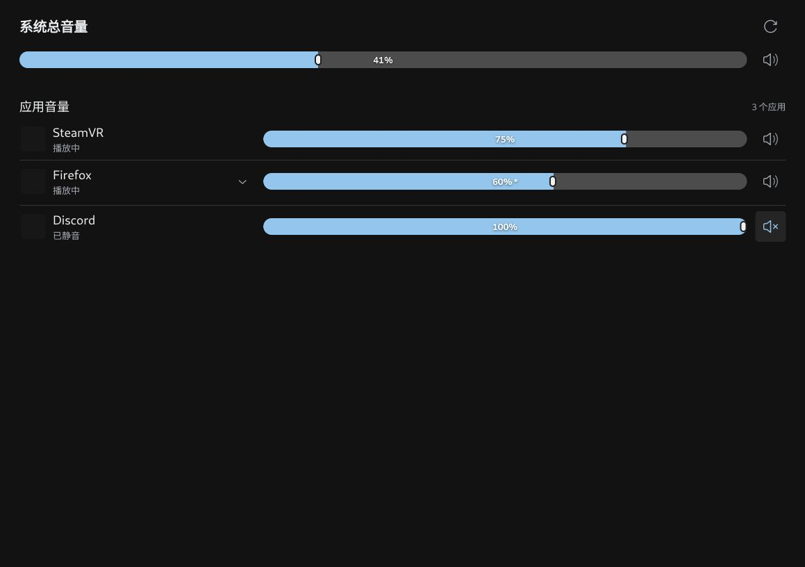

# Frame 音量合成器

Framely 插件 `tooru.volume-mixer`，在 SteamOS 音频会话用户下运行，无需 root。顶部调节系统总音量及静音，下方按应用独立调节；同一进程的多条流可展开分别设置。胶囊滑块内显示百分比，透明背景沿用宿主，界面自动跟随 Framely：中文显示中文，其余语言显示英文，没有独立语言开关。

安卓 Lepton 应用通过音频容器主机名匹配 Framely APK 管理记录，读取应用名称和图标；其他应用尝试读取系统图标，缺失图标显示空白占位。应用原始名称不翻译。



## 工作方式

使用 PipeWire `pw-dump` 发现播放流，关联 Client 属性取得应用、进程及流状态，通过 `wpctl` 读取/设置音量和静音，支持原生 PipeWire 与 PulseAudio 客户端。音量范围 0–100%，松开滑块或方向键时提交；状态约每 500ms 刷新，保留调节值直到设备确认。

写入前检查 PipeWire 服务 cookie、节点 ID 与序列号，拒绝已经退出或被复用的流。录音流、虚拟处理链及音频服务内部流不提供应用控制；顶部仅控制当前默认播放设备。

“播放中”表示流正在处理，不能证明音频信号非零。多个来源混在一条流时只能控制整体音量；未进入 PipeWire 的 ALSA 独占播放无法列出。多流写入不是原子事务，恢复音量由 WirePlumber 或应用决定。停止插件不会回滚用户的音量修改。

## 开发与本地构建

需要 Node.js 22、Rust，以及目标平台 C linker。

```sh
npm ci
npm run typecheck
npm test
npm run test:i18n
python3 -m unittest discover -s tests -p 'test_*.py' -v
```

ARM64 主机可直接运行 `npm run build`。其他平台交叉构建：

```sh
rustup target add aarch64-unknown-linux-gnu
CARGO_BUILD_TARGET=aarch64-unknown-linux-gnu \
CARGO_TARGET_AARCH64_UNKNOWN_LINUX_GNU_LINKER=aarch64-linux-gnu-gcc npm run build
python3 scripts/pack.py
```

需要先安装 ARM64 GNU linker。安装包位于 `dist/tooru.volume-mixer-<version>.framely`，附带 `SHA256SUMS`。打包脚本从 Git remote 或 `GITHUB_REPOSITORY` 推导固定 Release 下载地址，不修改源码 manifest；包内包含 ARM64 后端、页面和根目录 `icon.png`。

设备运行时只需系统已有的 `pw-dump`、`wpctl`，无需 Node、Python 或 Rust。可使用 `framely verify <package>` 再次验证。

`npm run dev` 提供模拟预览：`/main`、`/quick`；`/host` 模拟 Framely 容器背景。`hostLanguage=zh-CN`、`en-US` 或 `fr-FR` 模拟宿主语言，`hostLanguageAfter` 模拟运行时变化，`lag=1` 模拟延迟回读。预览不会操作设备。

## GitHub Actions 发布与数据库登记

参照 Termix、透视插件的流程：

仅版本标签触发构建，推送 `main` 或提交 PR 不触发构建。

1. 推送与 `manifest.version` 一致的 `v<version>` 标签，自动构建并发布 GitHub Release，上传 `.framely` 和 `SHA256SUMS`。
2. 发布成功后，更新数据库仓库的插件子模块，固定到标签对应的源码提交。正式版更新 `main`，预发布版更新 `testing`。

数据库默认使用 `toorux/framely-plugin-database`。在本仓库 **Settings → Secrets and variables → Actions** 配置：

- Secret `DATABASE_TOKEN`：能够写入目标数据库仓库 Contents 的 token。GitHub 默认 `GITHUB_TOKEN` 不能写入另一个仓库。
- 可选 Variable `DATABASE_REPOSITORY`：覆盖目标仓库，格式为 `owner/repository`。

```sh
git tag v0.2.10-preview.1
git push origin v0.2.10-preview.1
```

手动运行 **Release plugin** 时选择对应版本标签。发布成功但数据库登记失败时，运行 **Register plugin in database**，填入已发布的标签；重试不会修改其他插件或重复提交。该流程更新作者的数据库仓库，不自动向上游创建 PR。

## 验证与第三方代码

测试覆盖音频流关联、捕获流排除、身份复用/服务重启保护、音量范围、宿主语言规则、发布包确定性、哈希校验、数据库分支选择和固定提交登记。`tests/device.py <backend>` 在设备创建临时静音流进行回归，默认播放设备只写回已有设置。设备端细节见 [VALIDATION.md](VALIDATION.md)。

`vendor/framely-sdk` 来自 [Framely](https://github.com/SteamFramelyHomebrew/framely)，使用 AGPL-3.0-only，许可证保存在其目录；本地增加了与宿主一致的语言读取接口。React、Radix 等依赖通过 npm 安装。
